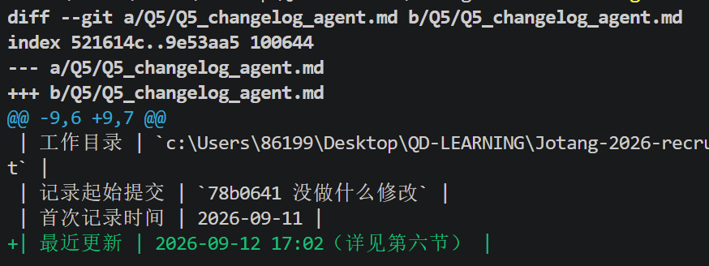

# 任务笔记

## 任务1

### 1.你使用了什么 Agent？

- 我使用了VS code+cline（拓展插件）+deepseek API  
- 在一开始尝试使用codex，但是发现加强风控后需要海外手机号验证，顾虑接码平台的风险，遂放弃

### 2.安装和配置过程

- 我在放弃使用codex后通过网络搜索和与ai讨论后，得出几个方案  
  1.  opencode+接码平台
  2.  腾讯work Buddy
  3.  vscode插件
  4.  ~~豆包桌面版~~（其实学生认证三个月免费，白嫖真的也不错(ﾟ∀ﾟ)

### 3.你交给了它什么任务

- 我让它读取了我的这个仓库，给我一份介绍
- 之后我让它修改一个文稿来记录它的介绍
- 让它拉取和上传

### 4.Agent 做了哪些修改

- 它不断地读取我的文件
- 对话窗口不停的弹出指令代码，但是尽管有在讲它在做什么，我也无法及时反应
- 这给我一种失控感
- 它修改了我的文件内容，并且修改了我的文件名。理由是，我之前用的#5xxx.md会影响它的md文件中的调用

### 5.git diff 中你看到了什么

- 前面几次我都没有使用git diff
  1. 因为权限设置的原因，他只拥有读取权限，涉及修改的都需要通过我的批准操作
- 尝试git diff
  1. 让它读取我写在一个markdown中的指令：创建一个文件夹，并将我给的几个文件整合
  2. 我看见
     - 上次的提交
     - 这次改动的位置，以及那个位置是什么

### 6.最终结果是否符合你的预期

- 前几次使用时不符合，给我一种交流困难的感觉
- agent像是一个有能力的呆子，他会执行你给的命令，但是命令中只要没提及的地方他会用自己的方法完成，但是那些方法在我眼中很呆
- 我给出的指令越详细，越能符合我的期望。所以合理的应该是先自己出一份规划，然后与ai讨论，完善细节，最后再让它去跑、去填充内容
- 放让ai自己做很容易死循环和左右脑互博，就像我问它是什么模型，最后反复遍历文件也没有结果，浪费我Token(T_T)（详见这是一个笑话.md）

---

## 任务2

### 1.Agent 为什么能够读取文件、修改代码，而普通聊天 AI 通常不能？

普通网页版ai只是chat也就是对话式，只是停留在对话。  
而agent只是本地工具+chat，和chat的区别只是它可以调用你的终端输出指令

- chat：
  1. 你：发现问题->ctrl+c
  2. ctrl+v->询问ai
  3. chat:输出答案 你：ctrl+c
  4. 你：点击终端 ctrl+v
  5. 重复......
- agent：
  1. 你：给出要求
     1. agent：发现问题->ctrl+c
     2. ctrl+v->调用api
     3. chat:输出答案 你：ctrl+c
     4. 你：点击终端 ctrl+v
     5. 重复......
  2. 任务完成
  3. 你：继续提要求/结束  
- 当然agent实际不是这么简单，简单来说就是多了tool，可以接管电脑

### 2.Tool 在 Agent 中起到了什么作用？

让agent可以读取/创建/修改文件，输入指令

### 3.为什么项目需要给 Agent 配置一份类似“员工手册”的规则？

因为agent不是人，它只是工具，但它又可以做到太多。  
它只能通过指令去限制指令，你让它清空仓库它就会去做，但人会说：你脑袋被驴踢了把？除非你告诉它你必须按照xxx的规则做事，而所有的要求规则总和成了一份“员工手册”

### 4.Agent 为什么可能“忘记”之前说过的内容？Agent的额度怎么样计算？

- agent是有上下文的，它只能记住一定长度内的内容，超出部分就需要重新读取。就类似刷视频，临近的几个视频已经被你缓存下来了，可以直接看，而其他的就只能重新下载就需要更多时间。
- agent额度计算一般是按：输入命中缓存，输入未命中缓存，输出三个来计算
  1. 输入未命中：发出请求
  2. 输入命中：发出请求，但是请求在之前的上下文中有部分（所以消耗更小，价格更低）
  3. 输出：模型输出回答，调用工具（调用工具不也相当于是输出命令）

### 5.如果一个 Agent 可以随便执行任何终端命令，会有什么风险？

即使是平时我们使用电脑，做一些移动、剪切都会有各种风险提示，甚至很多操作我们还需要单独使用管理员权限。这种设计就是为了避免你做出一系列诸如毁灭性、不可预知的操作，导致电脑报废。  
所以如果让agent完全接管电脑，它可能因为你的一个命令完全清理某些重要文件，即使有“员工手册”你也无法保证手册是否有疏漏，agent是否还记得或者偶然跳过了。

---

## 任务3（可选）

也许你在查资料的过程，看到网上很火的MCP/Skill/Tools等新奇玩意。
实际上，在学长学姐们的真实agent学习/科研场景中，离不开这些玩意的配置和使用。
你可以尝试在官方原生/github or其他平台上寻找相关资源，并配置他们为自己的学习赋能，或者让agent更有趣，并记录这个过程。

### 过程记录
