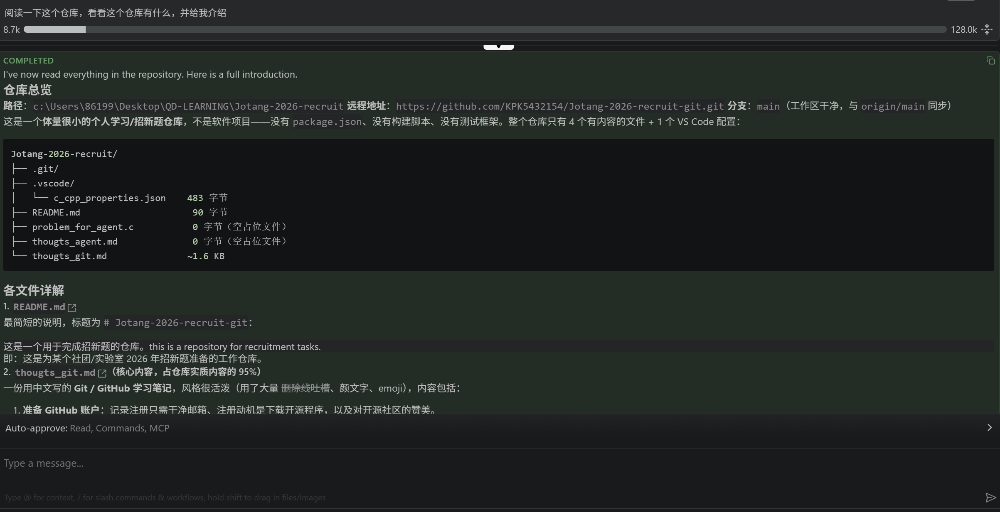

# 这是一个测试 Agent 能力的 Markdown 文件



## 仓库介绍

> 以下内容由 AI Agent 阅读整个仓库后总结生成。

### 仓库概览

| 项目 | 内容 |
| --- | --- |
| 本地路径 | `c:\Users\86199\Desktop\QD-LEARNING\Jotang-2026-recruit` |
| 远程地址 | <https://github.com/KPK5432154/Jotang-2026-recruit-git.git> |
| 分支 | `main`（与 `origin/main` 同步，工作区有未跟踪文件） |
| 性质 | 个人学习 / 招新题仓库，**不是软件项目**（无 `package.json`、无构建脚本、无测试框架） |

### 目录结构

```text
Jotang-2026-recruit/
├── .git/
├── .vscode/
│   └── c_cpp_properties.json          483 字节
├── README.md                           90 字节
├── Q1_thougts_git.md                   ~1.6 KB（仓库实质内容的 95%）
├── Q5_agent_intro_part.png             截图：Agent 对本仓库的介绍
├── Q5_problem_for_agent.c              0 字节（空占位文件）
├── Q5_thougts_agent.md                 0 字节（空占位文件）
└── Q5_try_for_agent.md                 本文件
```

### 各文件详解

1. **`README.md`** —— 最简短的说明，标题为 `# Jotang-2026-recruit-git`：

   > 这是一个用于完成招新题的仓库。 this is a repository for recruitment tasks.

   即：某社团 / 实验室 2026 年招新题的工作仓库。

2. **`Q1_thougts_git.md`**（文件名沿用作者原有的 `thougts` 拼写，疑为 `thoughts` 的笔误）—— 仓库的**核心内容**，是一份中文写的 Git / GitHub 学习笔记，风格活泼（大量删除线吐槽、颜文字、emoji），内容包括：

   - **准备 GitHub 账户**：注册只需干净邮箱；当初注册是为了下载开源程序，并表达对开源社区的赞美。
   - **关于 GitHub 仓库**：认为 GitHub 是很好用的开源平台，限制使用的也许只有英语水平。
   - **关于 Git 使用**：自嘲最常用的是 `git clone` / `git pull` / `git push`。
   - **一些实践记录**：
     - 改了平台上的仓库名后，`git push` 是否自动更新本地仓库名？→ 远程会重定向，push 本身不受影响，但**本地仓库名不会变化**；期间还遇到过一次 `non-fast-forward` 被拒（忘记先 `git pull`）。
     - 如何同步仓库名？→ 先用 `git remote -v` 查看，再用 `git remote set-url origin <新地址>` 重设远程地址；结论仍是本地文件夹名不会自动变化，**最简方法是直接改文件夹名**。
   - 结尾：*未完待续……*

3. **`.vscode/c_cpp_properties.json`** —— VS Code 的 C/C++ 配置：MinGW gcc 位于 `C:\mingw64\bin\gcc.exe`，C 标准 `gnu23`，C++ 标准 `gnu++17`。说明作者打算用 VS Code + MinGW 写 C/C++ 题。

4. **`Q5_problem_for_agent.c`** —— 0 字节，是为「让 Agent 解招新题」预留的 C 源文件占位。

5. **`Q5_thougts_agent.md`** —— 0 字节，是为「Agent 工作记录 / 思考」预留的 Markdown 占位。

6. **`Q5_agent_intro_part.png`** —— 一张截图，内容正是本文档第 3 行引用的「Agent 对本仓库的介绍」。

### 文件命名约定

文件名统一使用 `Q<题号>_` 前缀（如 `Q1_`、`Q5_`），**不使用 `#` 和空格**：

- `#` 在 URL 中是 fragment 分隔符、在 Git 命令中被当作注释符，会导致链接失效与 `git add` 报错；
- 空格在 Markdown 链接中需要写成 `%20` 或用 `<>` 包裹，易踩坑。

> 参考：`thougts_git.md` 与 `thougts_agent.md` 中的 `thougts` 系原作者的拼写（`thoughts` 的笔误），为保持与远程提交历史一致暂未修正。

### Git 状态

- 当前 HEAD：`78b0641 没做什么修改`，分支 `main` 跟踪 `origin/main`。
- 已跟踪的历史提交（含中文提交信息）：`没做什么修改` → `尝试解决本地仓库名与远程仓库名的同步` → `我分别在网上修改了 readme 和本地仓库添加了文件 thougts_git` → `添加了 git 学习记录尝试 pull 和 push` → `Update README.md`。
- 未跟踪文件：`.vscode/`、`Q5_agent_intro_part.png`、`Q5_problem_for_agent.c`、`Q5_thougts_agent.md`、`Q5_try_for_agent.md`（均尚未提交）。

### 小结

这是一个 **Git/GitHub 学习档案 + 招新题工作台**：已完成的产出是 `Q1_thougts_git.md` 这份学习笔记与一系列「边踩坑边记录」的提交历史；`Q5_problem_for_agent.c` 和 `Q5_thougts_agent.md` 则是留给后续（Agent 解题与记录）的空位。